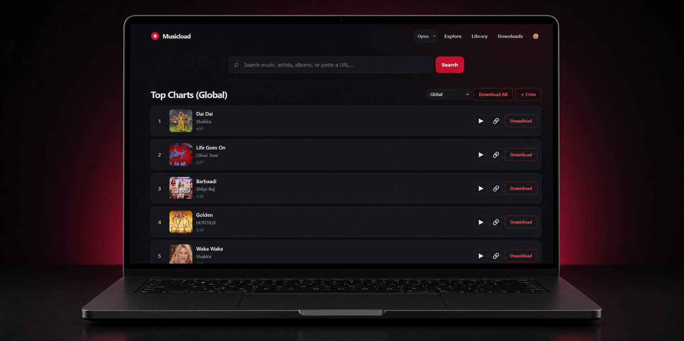
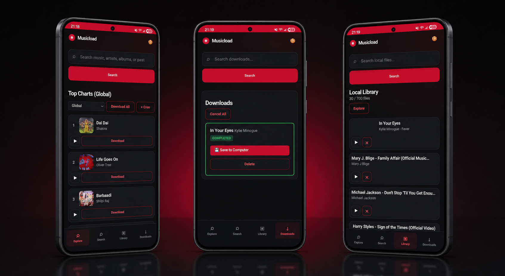
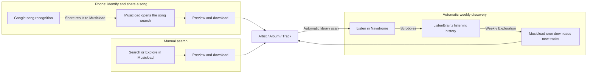

<p align="center">
  
</p>

Musicload is the missing link between **Music** and **Navidrome**. It is a fast, mobile-friendly web app for finding music, downloading full albums, managing local files, and automatically fetching your ListenBrainz Weekly Exploration.

It deliberately stays simple: Musicload downloads music into your own library, and Navidrome remains your player and library server.

## Preview

<p align="center">
  
</p>

<p align="center">
  
</p>

## How the workflow works



### From Google song recognition on your phone

Identify a song with Google, open the result, and use Android's **Share** action to send it to the installed Musicload app. Musicload opens the matching search so you can preview the result, confirm the correct version, and download it. The track is stored in the album folder and appears in Navidrome after its normal library scan.

### Automatic ListenBrainz Weekly Exploration

Connect Navidrome to ListenBrainz so your listening history is scrobbled automatically. ListenBrainz creates a new **Weekly Exploration**, and the Musicload cron worker downloads its tracks on your chosen schedule. They use the same album folder structure and are picked up by Navidrome automatically.

### Manual search

Search for a song, artist, album, or supported URL directly in Musicload. Preview the result, press **Download**, and the track becomes available in Navidrome through the shared music folder. Your own music can be copied into the same `Artist/Album` structure as well.

Musicload does not need direct Navidrome API access for any of these workflows. Both applications simply use the same music directory, and Navidrome's regular scanner discovers the new files.

1. Connect Navidrome to your ListenBrainz account in Navidrome's settings. Your listening history is then sent to ListenBrainz.
2. ListenBrainz creates your **Weekly Exploration** recommendations.
3. Musicload's cron worker reads those recommendations on the schedule you choose and downloads the tracks.
4. With `MUSICLOAD_ORGANIZATION_MODE: album`, downloads are stored as `Artist/Album/Track` instead of a flat folder.
5. Navidrome scans the same music folder and adds new files to its library automatically at its next regular scan.

Manual downloads work in exactly the same way: search or explore in Musicload, press **Download**, and the track is placed in the album structure. To add your own music, simply copy it into the same `Artist/Album` folder; Navidrome and Musicload will see it as local music.

## Quick start

You need only two files next to each other:

- `docker-compose.yml` — starts Musicload **and** the cron worker together.
- `cron.yaml` — your ListenBrainz schedule. Start with [`cron.yaml`](cron.yaml).

In `docker-compose.yml`, set the left side of this volume to your real music folder or NAS path:

```yaml
- /mnt/storage/media/Musik:/downloads
```

In `cron.yaml`, keep only the ListenBrainz job you want. Example for Weekly Exploration every Monday at 08:00:

```yaml
playlists: {}
plugins:
  listenbrainz-weekly:
    type: listenbrainz
    sync: false
    schedule: "0 8 * * 1"
    config:
      user: your_listenbrainz_username
      recommendation_type: weekly-exploration
```

Optional YouTube or YouTube Music playlist subscription:

```yaml
playlists:
  favorites:
    url: https://music.youtube.com/playlist?list=YOUR_PLAYLIST_ID
    sync: false
    schedule: "0 6 * * *"
```

The cron worker intentionally supports only these two sources.

Then start everything with one command:

```bash
docker compose up -d
```

Open `http://SERVER_IP:8000`.


Musicload keeps its state, cookies, and cron history in the hidden `.musicload` folder inside your music directory. Do not delete that folder unless you intentionally want to reset Musicload's history.

## Navidrome setup

Mount the **same host music folder** into both containers. Musicload needs write access; Navidrome can use a read-only mount:

```yaml
# Musicload
- /mnt/storage/media/Musik:/downloads

# Navidrome
- /mnt/storage/media/Musik:/music:ro
```

That shared folder is all Navidrome needs to discover Musicload downloads. Ensure Navidrome's normal library scanner is enabled; new music appears after its next scan.

## Install as an app

Musicload is a Progressive Web App (PWA). For reliable installation and Android sharing, serve it through a trusted **HTTPS** address — for example with Nginx Proxy Manager, Caddy, Cloudflare Tunnel, or Tailscale.

### Android (Chrome)

1. Open your Musicload HTTPS address in Chrome.
2. Open the three-dot menu.
3. Choose **Install app** or **Add to Home screen**.
4. Open Musicload from the new red Musicload icon.

### iPhone and iPad (Safari)

1. Open your Musicload HTTPS address in Safari.
2. Tap **Share**.
3. Choose **Add to Home Screen**.
4. Confirm **Add**. Musicload opens from its red home-screen icon like a normal app.

## Environment options

All settings live directly in `docker-compose.yml`; no `.env` file is required. The defaults in the included Compose file are already suitable for most installations.

| Variable | Default | Purpose |
| --- | --- | --- |
| `MUSICLOAD_DOWNLOAD_DIR` | `/downloads` | Path inside the container that holds your music. |
| `MUSICLOAD_DATA_DIR` | `/downloads/.musicload` | State, cookies, cache, and cron history. |
| `MUSICLOAD_WEB_PORT` | `8000` | Web server port inside the container. |
| `MUSICLOAD_AUDIO_FORMAT` | `opus` | `opus`, `mp3`, or `flac`. |
| `MUSICLOAD_ORGANIZATION_MODE` | `flat` | Use `album` for `Artist/Album/Track` folders. |
| `MUSICLOAD_FILENAME_TEMPLATE` | artist – title | Custom filename pattern for flat downloads. |
| `MUSICLOAD_USE_PRIMARY_ARTIST` | `false` | Prefer the main artist over a complete artist list. |
| `MUSICLOAD_ALLOW_UGC` | `false` | Allow user-generated YouTube uploads in results. |
| `MUSICLOAD_WEB_PLAYLIST` | unset | Optional M3U playlist name for manual web downloads. |
| `MUSICLOAD_MULTI_USER` | `false` | Prefix web playlists by remote user. |
| `MUSICLOAD_CORS_ORIGINS` | `*` | Allowed browser origins, comma-separated. |
| `MUSICLOAD_COOKIE_MODE` | `auto` | Cookie usage: `auto`, `always`, or `never`. |
| `MUSICLOAD_COOKIE_RETRY_DELAY` | `1.0` | Wait time before a cookie retry, in seconds. |
| `MUSICLOAD_LOG_COOKIE_USAGE` | `true` | Log whether cookies are used. |
| `MUSICLOAD_UNAVAILABLE_COOLDOWN_HOURS` | `168` | How long unavailable tracks are remembered; `0` disables it. |
| `MUSICLOAD_LYRICS_CACHE_HOURS` | `168` | Negative lyrics-cache lifetime; `0` never expires. |
| `YT_DLP_COOKIE_FILE` | unset | Optional mounted `cookies.txt` path. |
| `GOTIFY_URL` / `GOTIFY_TOKEN` | unset | Optional Gotify notifications. |


## License

Musicload is distributed under the [MIT License](LICENSE). Keep the copyright notice in copies and derivatives.
