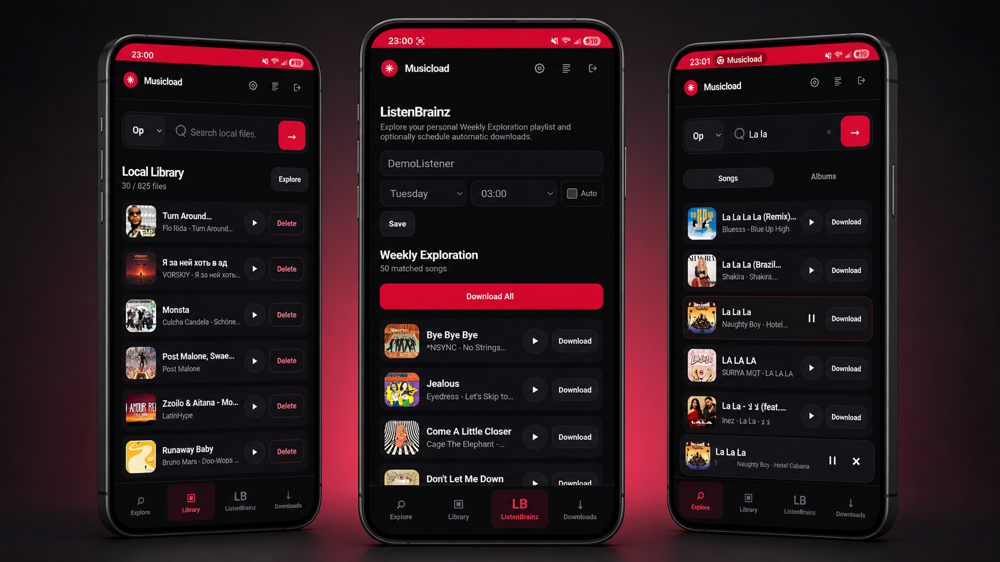
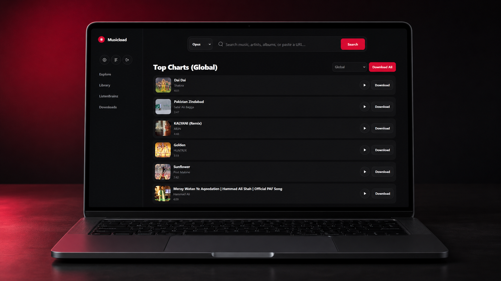

<p align="center">
  
</p>

<h1 align="center">Musicload</h1>

<p align="center">
  A simple, self-hosted music discovery and download companion for your Navidrome library.
  Search, preview, download — done.
</p>

<p align="center">
  
</p>

Musicload was built for a home or family music server where adding one song should not require SSH, manual tagging, or downloading an entire album. It writes finished files directly into your music folder; Navidrome finds them during its normal library scan. No direct Navidrome API connection is required.

## Highlights

- **One-song-first:** search YouTube Music, preview the result, and download exactly the track you want.
- **Albums and playlists when needed:** download complete albums or paste YouTube, YouTube Music, and Deezer playlist links.
- **Music discovery:** browse global or country charts, new releases, moods, genres, and curated playlists.
- **ListenBrainz Weekly Exploration:** preview and download recommendations individually, download all, or schedule them for a chosen weekday and time.
- **Local Library:** search, inspect, play, and manually delete files from the browser — no SSH or file manager required.
- **Safe duplicate review:** find likely duplicates by meaningful words in the song name, compare cover, artist, album, path, format, size, duration, and audio, then decide yourself. Nothing is changed or deleted automatically.
- **Clean library structure:** organize downloads as `Artist/Year - Album/Track - Title` or use a flat folder with a custom filename template.
- **Ready for music servers:** embeds artwork and metadata, preserves multiple artists, and can add synced LRCLIB lyrics as `.lrc` files.
- **Opus, MP3, or FLAC:** choose the format before downloading. FLAC output does not make a lossy source lossless.
- **Download control:** see live progress, speed, ETA, completed items, and failures; cancel one job or the whole queue.
- **Installable web app:** responsive desktop UI and PWA installation on Android, iPhone, and iPad.
- **Useful optional extras:** Navidrome login and admin permissions, per-user M3U playlists, Gotify notifications, and private `cookies.txt` management in Settings.
- **Web UI and CLI:** use the friendly browser interface day to day or automate searches, downloads, exploration, and library tagging from the command line.

<p align="center">
  
</p>

## Quick start with Docker Compose

Clone the repository and change only the host path on the left side of the music volume in `docker-compose.yml`:

```yaml
services:
  musicload:
    image: ghcr.io/kingdaniel4747/musicload:latest
    container_name: musicload
    init: true
    ports:
      - "8000:8000"
    volumes:
      - /your/music/folder:/downloads
      - ./.musicload:/data
    restart: unless-stopped
    security_opt:
      - no-new-privileges:true
```

Start it:

```bash
docker compose up -d
```

Open `http://SERVER_IP:8000`, select **Settings**, and configure Musicload from the web interface. Keep `/data` persistent because it stores settings, caches, accounts, logs, indexes, and an optional uploaded cookie file.

### Use the same library as Navidrome

Mount the same host folder in both containers:

```yaml
# Musicload needs write access
- /your/music/folder:/downloads

# Navidrome only needs read access
- /your/music/folder:/music:ro
```

The default result looks like this:

```text
Artist/
└── 2026 - Album/
    ├── 01 - First Track.opus
    ├── 01 - First Track.lrc
    └── 02 - Second Track.opus
```

## Everyday workflow

1. Open Musicload in the browser or installed PWA.
2. Search for a song, open an album, paste a playlist URL, or discover something new.
3. Preview the audio and select **Download**.
4. Follow the job in **Downloads**.
5. Play or remove files later from **Library**. Navidrome picks up new files during its next scan.

## ListenBrainz

Enable the ListenBrainz tab in **Settings**, restart Musicload, and save a ListenBrainz username. Each signed-in user can preview up to 50 matched tracks from their Weekly Exploration playlist and download them individually or together. Automatic downloads only run at the chosen weekly time and only when the recommendation set has changed.

## Duplicate finder

Open **Settings → Library maintenance → Find duplicates**. Musicload groups files whose song names contain the same meaningful words while ignoring common additions such as `official audio`, `lyrics`, `copy`, and remaster years.

The result is only a suggestion. Different releases can still look similar, so Musicload shows the available details and lets you listen first. Every deletion requires your decision and confirmation. After deleting a file, the current result and scroll position remain unchanged until you select **Scan again**.

## Install on a phone

Use a trusted HTTPS address for reliable PWA installation and Android sharing.

- **Android:** open Musicload in Chrome and choose **Install app** or **Add to Home screen**.
- **iPhone/iPad:** open Musicload in Safari, select **Share**, then **Add to Home Screen**.
- **Android sharing:** share a recognized-song result or supported link with Musicload to open it in search.

Musicload is network-first and is not intended to work offline.

## Optional login and integrations

- **Navidrome login:** Musicload validates credentials through Navidrome and never stores the password. Use a strong session secret and keep HTTPS-only cookies enabled on an HTTPS deployment.
- **ListenBrainz:** personal Weekly Exploration recommendations and optional weekly downloads.
- **Gotify:** notifications for completed or failed downloads.
- **Cookies:** upload, replace, or remove a private Netscape-format `cookies.txt` from **Settings** when a source requires an authenticated YouTube session.
- **M3U playlists:** add web downloads to a playlist, optionally prefixed by the authenticated remote user.

When login is disabled, anyone who can reach Musicload is treated as an administrator. Do not expose an unauthenticated instance directly to the public internet.

## Command line

```bash
musicload search "Artist Track"
musicload download --query "Artist Track"
musicload download --url "https://music.youtube.com/watch?v=..."
musicload explore charts --country DE
musicload tag --dry-run /path/to/music
```

The optional `tag` command can enrich an existing library with missing metadata, artwork, lyrics, and ReplayGain tags. ReplayGain requires the external `rsgain` executable. The web duplicate finder never performs this enrichment automatically.

## Privacy and responsible use

Musicload is self-hosted. Its application data remains in your configured `/data` volume and downloaded media remains in your own music folder. Keep both locations private and backed up.

Only save media you are authorized to download and follow applicable laws and service terms.

## License

Musicload is available under the [MIT License](LICENSE).

If Musicload makes your library workflow easier, you can [support the project on Ko-fi](https://ko-fi.com/kingdaniel4747).
